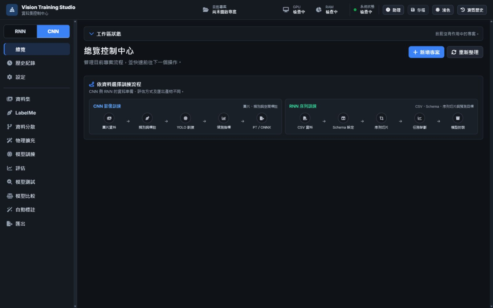

<div align="center">

# Vision Training Studio

**Windows 本機 AI 模型訓練、評估與匯出工作台**

支援 CNN 影像任務與 RNN 序列任務，從資料匯入、資料角色設定、訓練、評估、模型比較到交付產物，均在同一套本機介面完成。

[](docs/INSTALL.md)
[](VERSION)
[](docs/INSTALL.md)
[](docs/INSTALL.md)

[Windows 版本](https://github.com/kongbai0123/training/releases) · [使用指南](docs/USER_GUIDE.md) · [安裝說明](docs/INSTALL.md) · [疑難排解](docs/TROUBLESHOOTING.md)

</div>



## 產品定位

Vision Training Studio 專注於通用模型訓練流程：

1. 匯入可訓練的影像或序列資料。
2. 設定 CNN 類別與標註，或 RNN 時間、序列 ID、特徵與目標欄位。
3. 選擇符合任務與硬體的模型。
4. 執行訓練並查看任務感知評估指標。
5. 比較不同模型或同模型不同 run。
6. 匯出部署所需模型、schema、scaler、推論合約與報告。

專案助理只提供本機來源搜尋與診斷提示，不控制訓練決策，核心流程不依賴 LLM。

## Windows 使用方式

一般使用者應下載 Windows x64 Portable EXE：

1. 前往 [GitHub Releases](https://github.com/kongbai0123/training/releases)。
2. 下載 `VisionTrainingStudio_<version>_Windows_x64_portable.zip`。
3. 完整解壓縮後執行 `VisionTrainingStudio.exe`。

`VisionTrainingStudio.exe` 必須與 `_internal` 資料夾保持相對位置。終端使用者不需要另外安裝 Python 或 Node.js。

## 功能範圍

| 流程 | CNN 影像任務 | RNN 序列任務 |
|---|---|---|
| 資料 | 圖片、ZIP、影片影格 | CSV、CSV ZIP、本機序列檔 |
| 資料設定 | 類別、LabelMe、標註匯入、自動標註 | 時間欄、序列 ID、特徵、目標、任務類型 |
| 資料驗證 | 缺圖、缺標註、未知類別、分布與洩漏風險 | 缺失值、型別、序列長度、目標分布與資料洩漏 |
| 模型 | YOLO、RT-DETR、D-FINE、TorchVision 分類／偵測／分割模型、自訂 YOLO | LSTM、GRU、BiLSTM、XGBoost |
| 評估 | mAP、Precision、Recall、混淆矩陣、訓練曲線 | Accuracy、Macro-F1、MAE、RMSE、混淆矩陣、殘差診斷 |
| 比較 | 不同模型與同模型不同 run | 不同架構與同架構不同 run |
| 匯出 | PT、ONNX、Markdown 報告 | Model Package、Schema、Scaler、Inference Contract、報告 |

## 模型支援

- **YOLOv8、YOLO11、YOLO26**：Detection 與 Segmentation 均提供 `n/s/m/l/x` 官方權重選項。
- **RT-DETR-L/X**：Detection 的訓練、評估、推論與 ONNX 匯出已接入既有 run 生命週期。
- **圖片分類**：ResNet18、MobileNetV3 Large、EfficientNet-B0，可使用資料夾類別匯入並訓練。
- **物件偵測**：D-FINE Small、Faster R-CNN、FCOS，可安裝官方預訓練權重並訓練。
- **實例分割**：Mask R-CNN；每個物件保留獨立遮罩，可分別辨識與計數。
- **語意分割**：DeepLabV3 與內建 U-Net；將畫面像素分類成區域，不區分同類個體。
- **RF-DETR**：在模型中心提供官方 benchmark 與選型資訊；Windows 打包與完整依賴驗證尚未通過，因此不開放執行。
- **RNN/XGBoost**：內建 LSTM、GRU、BiLSTM 與 XGBoost 訓練範本。

訓練頁的模型清單依「圖片分類、物件偵測、物件輪廓分割、畫面區域分割」分組。ByteTrack 與 BoT-SORT 是影片推論時搭配偵測器使用的追蹤器，不是可獨立訓練的辨識模型，因此不會混入訓練模型清單。

詳細能力、授權與驗收狀態請參閱 [模型支援矩陣](docs/MODEL_SUPPORT.md)。

## 資料增強

- 支援陰天光色、晴天線索抑制、深度雨霧、三層雨絲、濕地面、積水、水花及獨立鏡頭水滴。
- 即時預覽使用可拖曳的原圖／增強圖分割線，設定變更後必須重新預覽才能大量套用。
- 旋轉、縮放、透視、翻轉與裁剪會同步重映射 Polygon／BBox；垂直翻轉或隨機裁剪啟用時，介面會提示使用者抽查標註與場景方向。
- 增強副本只加入 Train split，Val／Test 與原圖保持不變。

## 初次啟動

初次啟動精靈會引導設定：

- 繁體中文或英文
- 深色或淺色介面
- 介面密度與縮放
- 離線優先與自動儲存
- CPU、GPU、VRAM、RAM 與磁碟檢查
- 離線 LabelMe 元件
- 任務類型與選配模型

所有模型下載都必須由使用者明確確認，並在完成後驗證 SHA-256。

## 離線能力

- 已安裝的模型、既有專案、訓練、評估、比較與匯出可在本機執行。
- Managed LabelMe 元件安裝完成後可離線使用。
- 第一次下載模型、更新元件或啟用外部雲端服務時需要網路。
- 軟體不會在未告知的情況下上傳資料或自動下載模型。

## 開發與驗證

開發環境使用 Python 3.11。常用入口集中於 `scripts/`：

```bat
scripts\run.bat
scripts\test.bat
scripts\build.bat
scripts\package.bat
scripts\smoke_dist.bat
```

PyInstaller 產物：

```text
dist\VisionTrainingStudio\VisionTrainingStudio.exe
```

## 專案結構

```text
src/                 後端、訓練、模型、評估與匯出邏輯
static/              前端介面、樣式與繁中／英文字典
data/                內建模型目錄、benchmark 與研究閘門
tests/               單元、整合、UI 靜態與 smoke 測試
scripts/             啟動、測試、建置、打包與驗證腳本
packaging/           PyInstaller 設定
installer/           Windows 安裝器設定
docs/                使用、架構、部署與疑難排解文件
```

完整資料樹與執行期資料位置請參閱 [專案結構](docs/PROJECT_STRUCTURE.md)。

## 文件

- [安裝說明](docs/INSTALL.md)
- [使用指南](docs/USER_GUIDE.md)
- [模型支援矩陣](docs/MODEL_SUPPORT.md)
- [開發指南](docs/DEVELOPER_GUIDE.md)
- [系統架構](docs/ARCHITECTURE.md)
- [專案結構](docs/PROJECT_STRUCTURE.md)
- [部署指南](docs/DEPLOYMENT.md)
- [測試規範](docs/TESTING_GUIDELINES.md)
- [乾淨 Windows 驗證](docs/CLEAN_MACHINE_VALIDATION.md)
- [0.1.2 發布驗證紀錄](docs/RELEASE_VALIDATION_2026-07-22.md)
- [已知限制](docs/KNOWN_ISSUES.md)
- [疑難排解](docs/TROUBLESHOOTING.md)

## Release Gate

開發機測試、實際模型 smoke 與 packaged runtime smoke 通過，不等於已完成乾淨電腦驗收。正式 release 前仍需在未安裝 Python、Node.js 與開發依賴的 Windows 10/11 x64 電腦測試完整 portable ZIP。

## 授權

本 repository 尚未提供統一公開授權。第三方模型與套件授權資訊位於 `docs/compliance/` 與 [模型支援矩陣](docs/MODEL_SUPPORT.md)。
