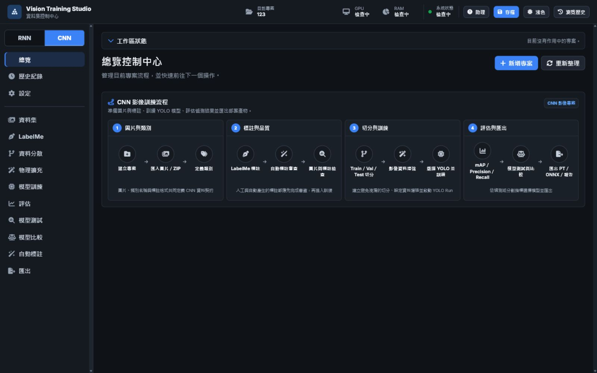
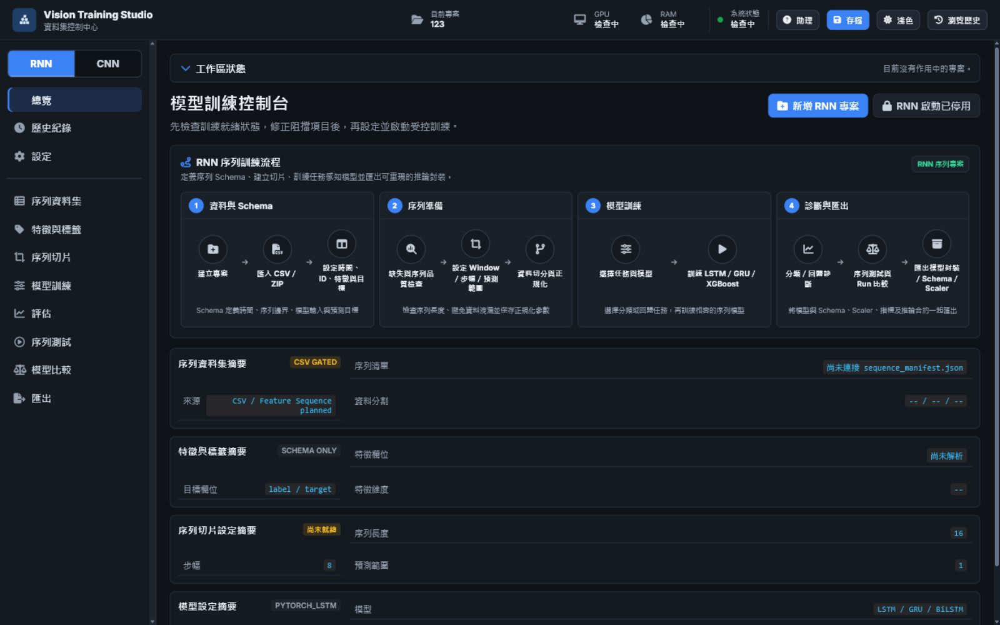

<div align="center">

# Vision Training Studio

**Windows 本機 AI 模型訓練與資料集工作平台**

整合 CNN 影像任務、RNN 序列任務、資料標註、資料增強、模型訓練、評估、比較與匯出。

[](docs/INSTALL.md)
[](VERSION)
[](https://github.com/kongbai0123/training/releases/latest)
[](docs/INSTALL.md)

[下載最新版](https://github.com/kongbai0123/training/releases/latest) ·
[安裝說明](docs/INSTALL.md) ·
[使用指南](docs/USER_GUIDE.md) ·
[模型支援](docs/MODEL_SUPPORT.md) ·
[疑難排解](docs/TROUBLESHOOTING.md)

</div>


## 軟體用途

Vision Training Studio 是以一般使用者操作為核心的 Windows 本機訓練工具，協助使用者在同一套介面中完成：

- 建立與管理 CNN、RNN 專案。
- 匯入圖片、標註資料、序列 CSV 與既有模型。
- 執行 LabelMe 標註、資料分割、資料增強與自動標註。
- 設定模型與訓練參數，使用 CPU 或 NVIDIA GPU 執行訓練。
- 查看逐 Epoch 指標、正式評估結果、Run 比較與模型產物。
- 匯出模型、評估圖表、報告及可供後續推論使用的套件。
- 使用專案助理查詢目前專案狀態、證據與下一步建議。

所有專案、模型、日誌與匯出資料預設儲存在使用者資料目錄，不會寫入程式安裝資料夾：

```text
%LOCALAPPDATA%\VisionTrainingStudio\
├─ projects\
├─ models\
├─ logs\
├─ cache\
├─ config\
└─ exports\
```

## 快速安裝

### 系統需求

- Windows 10 或 Windows 11，64 位元。
- 建議至少 16 GB RAM。
- CPU 可執行；大型模型建議使用支援 CUDA 的 NVIDIA GPU。
- 使用安裝版不需要另外安裝 Python 或 Node.js。

### 安裝步驟

1. 前往 [GitHub Releases](https://github.com/kongbai0123/training/releases/latest)。
2. 下載 `VisionTrainingStudio_Setup_<version>.exe`。
3. 如需驗證檔案完整性，同時下載對應的 `SHA256SUMS.txt`。
4. 關閉正在執行的舊版程式，再啟動安裝程式。

PowerShell 驗證範例：

```powershell
Get-FileHash .\VisionTrainingStudio_Setup_0.1.4.exe -Algorithm SHA256
```

輸出的雜湊值應與 Release 隨附的 checksum 相同。

## 核心工作流程

| 階段 | CNN 影像任務 | RNN／序列任務 |
|---|---|---|
| 專案設定 | 圖片分類、物件偵測、物件輪廓分割、畫面區域分割 | 分類、回歸、LSTM／GRU／BiLSTM／XGBoost |
| 資料匯入 | 圖片、ZIP、YOLO、分類資料夾與既有標註 | CSV 與 CSV ZIP |
| 資料準備 | LabelMe、資料品質檢查、Train／Val／Test 分割、資料增強 | 特徵與目標設定、時間與序列欄位、序列切片 |
| 模型訓練 | YOLO、RT-DETR、D-FINE、TorchVision、U-Net 等 | LSTM、GRU、BiLSTM、XGBoost |
| 評估 | mAP、Precision、Recall、分類與分割指標 | Accuracy、Macro-F1、MAE、RMSE 與殘差診斷 |
| 比較與匯出 | 比較多個 Run，匯出權重、ONNX、SVG 圖表與報告 | 比較多個 Run，匯出模型套件、Schema、Scaler 與報告 |

### CNN 影像工作流程



支援的視覺任務分為四類：

- **圖片分類**：判斷整張圖片屬於哪個類別，不產生方框。
- **物件偵測**：以方框標示物件位置與類別。
- **物件輪廓分割**：描出每個獨立物件的輪廓，可分開計數。
- **畫面區域分割**：標示道路、背景、天空等像素區域。

### RNN 序列工作流程



RNN 專案可指定特徵欄位、目標欄位、時間欄位與序列 ID，並透過序列切片建立固定長度的訓練視窗。分類任務顯示 Accuracy、Macro-F1、Precision 與 Recall；回歸任務顯示 MAE、RMSE、Loss 與殘差診斷。

## 主要功能

### 資料集與標註

- 圖片、CSV、ZIP 與既有標註匯入。
- 內建 LabelMe 工作區及 Polygon／BBox 標註流程。
- 資料品質檢查、類別統計與 Train／Val／Test 分割。
- CNN 天候、光照、模糊、雜訊、幾何與遮擋資料增強。
- 增強前後即時比較與 Polygon／BBox 幾何重映射檢查。

### 模型訓練與評估

- 模型依任務類型分類顯示，清楚區分已安裝、需安裝與任務相容性。
- CPU／CUDA 裝置選擇、早停、AMP、批次大小與資料載入設定。
- 訓練狀態、目前 Epoch、進度、執行時間與停止原因。
- 評估圖表依指標拆分顯示，並於每個 Epoch 完成後更新。
- 訓練完成後沿用同一份 Run 資料產生正式評估、比較與匯出內容。

### 本機資料與安全

- 專案資料與安裝目錄分離。
- 模型匯入、更新包與自訂套件皆執行格式及路徑安全檢查。
- 長時間工作提供統一進度、失敗原因與復原提示。
- 軟體更新採用簽章、SHA-256、備份、交易式替換與失敗回復。

## 版本與更新

此區只放版本發布、更新機制與發布驗證內容；其他安裝、使用、架構及補充文件請見下一節。

### 目前版本

- **最新穩定版：v0.1.4**
- [下載 Vision Training Studio v0.1.4](https://github.com/kongbai0123/training/releases/tag/v0.1.4)
- [完整版本變更紀錄](CHANGELOG.md)

v0.1.4 是增量更新功能的啟動版本。舊版使用者需要先安裝 v0.1.4 完整安裝程式；進入支援更新器的執行環境後，後續相容版本才能使用較小的簽署更新包。

### 發布驗證紀錄

以下依版本由新到舊排列：

1. [v0.1.4 更新系統與安裝驗證紀錄](docs/RELEASE_VALIDATION_2026-07-23_0.1.4.md)
2. [v0.1.3 發布驗證紀錄](docs/RELEASE_VALIDATION_2026-07-22_0.1.3.md)
3. [v0.1.2 發布驗證紀錄](docs/RELEASE_VALIDATION_2026-07-22.md)
4. [v0.1.1 發布驗證紀錄](docs/RELEASE_VALIDATION_2026-07-16.md)

### 更新系統文件

- [增量更新架構](docs/UPDATE_ARCHITECTURE.md)
- [更新包格式與安全規格](docs/UPDATE_PACKAGE_SPEC.md)
- [Release Notes 範本](docs/RELEASE_NOTES_TEMPLATE.md)
- [發布策略](docs/release_strategy.md)

## 其他文件

此區為安裝、操作、開發、品質、安全及維護補充內容，不與版本更新紀錄混排。

### 安裝與使用

- [安裝說明](docs/INSTALL.md)
- [使用指南](docs/USER_GUIDE.md)
- [模型支援矩陣](docs/MODEL_SUPPORT.md)
- [疑難排解](docs/TROUBLESHOOTING.md)
- [已知限制](docs/KNOWN_ISSUES.md)

### 開發與部署

- [開發指南](docs/DEVELOPER_GUIDE.md)
- [系統架構](docs/ARCHITECTURE.md)
- [專案結構](docs/PROJECT_STRUCTURE.md)
- [部署指南](docs/DEPLOYMENT.md)
- [自訂訓練外掛合約](docs/CUSTOM_TRAINING_PLUGIN_CONTRACT.md)
- [UI 設計系統](docs/UI_DESIGN_SYSTEM.md)

### 測試與品質

- [測試規範](docs/TESTING_GUIDELINES.md)
- [乾淨 Windows 驗證](docs/CLEAN_MACHINE_VALIDATION.md)
- [多語系稽核](docs/I18N_AUDIT.md)
- [PyInstaller 警告稽核](docs/PYINSTALLER_WARNING_AUDIT.md)

### 安全與執行邊界

- [Sandbox Dry-run 政策](docs/SANDBOX_DRY_RUN_POLICY.md)
- [Sandbox 威脅模型](docs/SANDBOX_THREAT_MODEL_P7.md)
- [離線模型助理執行說明](docs/OFFLINE_MODEL_ASSISTANT_EXECUTION.md)
- [第三方授權清單](docs/compliance/THIRD_PARTY_LICENSES.md)

## 開發者快速開始

### 建立環境

```bat
python -m venv .venv
.venv\Scripts\activate
python -m pip install --upgrade pip
python -m pip install -r requirements.txt
python -m pip install -r requirements-build.txt
```

### 啟動、測試與打包

```bat
scripts\start_dev.bat
scripts\test.bat
scripts\build.bat
scripts\package.bat
scripts\build_installer.bat
```

主要輸出：

```text
dist\VisionTrainingStudio\VisionTrainingStudio.exe
installer\output\VisionTrainingStudio_Setup_<version>.exe
```

## 專案結構

```text
src\          後端服務、資料處理、模型管理與更新系統
static\       前端頁面、元件、樣式與多語系內容
data\         內建模型目錄與決策資料
tests\        單元、整合、流程與靜態契約測試
scripts\      啟動、測試、建置、打包與驗證工具
packaging\    PyInstaller 打包設定
installer\    Windows 安裝器設定
updater\      獨立更新程式
updates\      更新基線、公鑰與格式 Schema
docs\         使用、開發、部署、驗證與安全文件
```

## 發布標準

正式版本必須通過相關自動化測試、打包檢查、安裝版啟動驗證及發布資產 checksum 核對。未完成乾淨環境與安裝版驗證前，不應宣稱版本已可正式交付。
