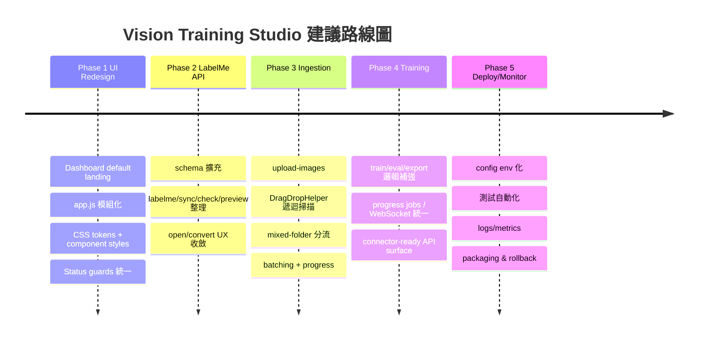

# kongbai0123/training 工程化優化報告

## 執行摘要

這個 repo 已經不是「從零開始」的雛形，而是**已經進入前端重設計後期、後端能力仍以 FastAPI 單體服務承載**的實作狀態：根目錄包含 `app.py`、`static/`、`src/`、`run.bat` 與 `requirements.txt`；GitHub 語言分布顯示以 Python、JavaScript、HTML、CSS 為主；目前 `app.py` 約 1033 行、`static/app.js` 約 2238 行、`static/style.css` 約 1631 行，代表功能已相當集中，但也形成明顯的單檔風險與維護負擔。citeturn1view0turn4view0turn5view3turn14view0

更重要的是，repo **已經部分落地你要的方向**：`static/index.html` 已經切到 Dashboard / Projects / Dataset / LabelMe / Split / Augmentation / Training / Evaluation / Export / History / Settings 的控制台導覽；`LabelMe Annotation Manager` 頁也已存在；後端也已經有 `upload-video`、`upload-dataset-files`、`import-annotations`、`labelme/sync`、`labelme/preview`、`labelme/open`、`labelme/convert` 等 API，表示最佳策略不是推翻重做，而是**前端優先整理、後端逐步去重與補齊缺口**。citeturn17view0turn17view1turn12view0turn12view2turn13view0

本報告的核心結論有三點。第一，**Phase 1 不應再大改訓練核心**，而應聚焦把目前已寫進 `static/` 的 Dashboard、LabelMe 管理器與拖曳上傳流程做成一致的設計系統與可靠互動。第二，**Phase 2 與 Phase 3 需要以「補 API、補資料模型、補非同步處理」為主**，不是再發明新的功能入口；尤其 `upload-images` 目前缺席，但 `upload-video` 與 `import-annotations` 已存在，因此應採「補缺、不重複」策略。第三，**相容性與安全性要先處理硬編碼與同步重工作業**，其中最明顯的是 `src/config.py` 將 `BASE_DIR` 寫死為 `d:/software/yolo`，以及 `config.py` 直接 `import torch`，但 `requirements.txt` 並未明確 pin `torch`，這會使部署與重建環境的成功率下降。citeturn3view2turn2view0

## Repo 現況與技術盤點

### 檔案地圖與技術堆疊

目前 repo 結構明確集中在三層：`static/` 承擔前端頁面、樣式與互動；`src/` 承擔專案管理、資料處理、切分、擴充、訓練與 LabelMe 轉接；`app.py` 做 API 聚合與靜態檔掛載。`run.bat` 會先開啟瀏覽器到 `http://127.0.0.1:8000`，再以 `python app.py` 啟動服務；靜態檔則透過 FastAPI/Starlette 的 `StaticFiles` 掛載提供。citeturn1view0turn18view0turn19view1turn10search1turn10search4

`requirements.txt` 顯示目前後端依賴主要是 FastAPI、Uvicorn、`python-multipart`、Pydantic、Ultralytics、OpenCV、Pillow、psutil、`nvidia-ml-py`、NumPy，以及 `sse-starlette`。這表示專案是**單體 FastAPI + 原生靜態前端 + YOLO/影像處理管線**的架構，而不是 React/Vite 或多服務拆分。citeturn2view0

### 目前前端其實已經是新版控制台

`static/index.html` 不再是早期的線性流程頁，而是完整列出了 Dashboard、Projects、Dataset、LabelMe、Split、Augmentation、Training、Evaluation、Export、History、Settings；Dataset 區已含「本機資料夾掃描」「ZIP 或資料夾上傳」「影片抽幀」入口；LabelMe 頁面已含 Workspace Paths、Progress Summary、JSON Check Results、Lightweight Preview、Conversion Actions，以及明確標註 Legacy Annotation Preview 已降級。這代表你的「首頁導覽控制台 + LabelMe 管理器」方向，**在主結構上已經落地**。citeturn17view0turn17view1turn17view2turn17view4

`static/app.js` 則顯示目前仍採**原生 JavaScript 單檔狀態管理**：有 `appState`、`labelme` 狀態、主題與語言偏好、各種 `bind*Actions()`、tooltip、project loading 與頁面導覽；但初始化後呼叫的是 `navigate("projects")` 而不是 `dashboard`，與新版 UX 目標仍有一個小落差。citeturn3view1turn16view1

### 後端能力已超出純 UI MVP

`app.py` 現有 API 已涵蓋專案 CRUD、圖片存取、`import-local`、`import-video`、`upload-video`、`upload-dataset-files`、`quality-check`、單張標註儲存、`labelme/sync`、`labelme/preview`、`labelme/open`、`labelme/convert`、訓練啟動/停止/狀態、WebSocket 監控與模型匯出。也就是說，後端其實並沒有停留在「只有 project 與 train API」的階段，而是已具備相當多 Phase 2–4 的能力。citeturn13view0turn12view0turn12view2turn19view1turn19view3

`src/project_manager.py` 顯示新專案會自動建立 `dataset/raw/images`、`dataset/raw/labels`、`dataset/raw/annotations/labelme`、`dataset/splits`、`dataset/augmentations/augmented_images`、`training/runs`、`training/logs`、`exports/onnx`、`exports/reports` 等目錄；`project.json` 目前已有 `project_id`、`project_name`、`task_type`、`dataset_path`、`class_names`、`annotation_progress`、`images`、`split_config`、`augmentation_config`、`training_config`、`training_runs`。這是好的基礎，但對歷史版本、LabelMe 工作區、上傳批次追蹤仍不夠。citeturn15view0turn15view1turn15view2

### 關鍵硬傷與工程風險

最直接的硬傷是 `src/config.py` 將 `BASE_DIR` 寫死為 `Path("d:/software/yolo").resolve()`。這在單機開發時方便，但會讓任何不同磁碟、不同帳號、容器化環境、CI runner 或 Linux/macOS 部署直接產生不相容風險。`config.py` 還直接 `import torch` 做 GPU 偵測，但 `requirements.txt` 並未明確 pin `torch`，也就是 repo 目前對 torch 版本與安裝來源依賴於間接相依，重建環境可重現性較弱。citeturn3view2turn2view0

第二個風險是**單檔過大**。`app.py`、`app.js`、`style.css` 都已經達到千行級別，其中 `app.js` 單檔 2238 行，是當前 UI 維護成本最大的來源。這不是框架問題，而是**責任邊界尚未被拆開**：頁面導覽、狀態推導、UI rendering、API 呼叫、拖曳邏輯與訓練監控都夾在同一檔案內。citeturn4view0turn5view3turn14view0

第三個風險是**部分功能命名與實際狀態已不一致**。例如 `index.html` 在 LabelMe 區寫著「Phase 2 backend」，但後端其實已經存在 `labelme/sync`、`labelme/preview`、`labelme/open`、`labelme/convert`；另一方面，`upload-images` 反而沒有獨立端點，而是以 `upload-dataset-files` 兼收圖片、JSON、TXT。這種「已實作但 UI 語意未跟上／未實作但需求文件仍以為存在」的落差，會持續增加後續需求溝通成本。citeturn17view1turn12view0turn12view2turn12view3

還有一個實際 bug 風險：`app.py` 的匯出邏輯中使用了 `YOLO(...)`，但在檔頭 import 列表中可見的只有 `YOLOTrainer`，並未看到從 `ultralytics` 匯入 `YOLO`；如果該段落沒有在其他位置補 import，匯出路徑在執行時可能失敗。這是應優先修掉的「小但致命」問題。citeturn19view1turn19view3

## 優先改善清單與取捨原則

下表是依「影響大、風險可控、對現有結果破壞最小」排序的改善優先序。排序原則不是功能炫度，而是**先讓現有結構穩、再補缺口、最後才考慮框架更替**。citeturn17view0turn13view0turn3view2

| 優先項 | 建議 | 原因 | 風險 | 優先度 |
|---|---|---|---|---|
| 前端導覽一致化 | 讓預設首頁回到 Dashboard；統一 status guard / disabled action / recent activity 呈現 | 現在結構已經是控制台，但初始導頁仍落到 Projects，UX 不一致。citeturn16view1turn17view0 | 低 | 最高 |
| `app.js` 模組化拆分 | 以 IIFE/ES module 分拆為 `state.js`、`api.js`、`pages/*.js`、`dragdrop.js` | 2238 行單檔是目前最大維護負擔。citeturn5view3 | 中 | 最高 |
| `upload-images` 補齊 | 新增純圖片批次上傳 API，不再把 Dataset 混合上傳全部塞進 `upload-dataset-files` | 現狀只有混合上傳與影片上傳，缺少清晰的圖片批次管道。citeturn13view0turn12view3 | 低 | 高 |
| DragDrop 分流重構 | 保留「可拖大雜燴」，但每個 dropzone 僅處理自身類型 | 目前 Dataset 區文案就允許 ZIP/Folder，若不分流，錯誤處理與使用者心理模型都會混亂。citeturn17view0turn17view1 | 中 | 高 |
| `project.json` 補 LabelMe 與 history 欄位 | 加入 `labelme_config`、`labelme_progress`、`imports_history`、`versions` | 現有 schema 有訓練與 split，但沒有工作區與匯入歷史。citeturn15view0turn15view2 | 低 | 高 |
| `config.py` 去硬編碼 | 改以 `Path(__file__).resolve().parents[1]` 與環境變數為優先 | 這是跨環境相容性的最大單點風險。citeturn3view2 | 低 | 高 |
| 重工作業非同步化 | 大量上傳、品質檢查、LabelMe sync、ZIP 匯入改為 job + progress | FastAPI 官方建議耗時工作可用 BackgroundTasks；目前同步做法會拖長 request。citeturn8search1turn10search20 | 中 | 中高 |
| 匯出與依賴修補 | 補 `YOLO` import、評估 `sse-starlette` 是否移除、明確處理 torch 依賴 | 直接提升執行成功率與環境可重現性。citeturn2view0turn19view1turn19view2 | 低 | 中高 |
| React/Vite 遷移 | 暫緩到原生 JS 模組拆分完成後再評估 | React 官方已不建議新案使用 CRA，並建議採框架或 Vite 等 build tool；但目前 repo 與 FastAPI static file 同源部署非常適合先保留原生 JS。citeturn11search20turn11search3turn11search5 | 中高 | 中 |

**關鍵判斷**：現階段最好的策略不是直接全面改 React，而是先保留原生 JS，把 `app.js` 拆責任、把拖曳與頁面渲染抽模組。等到頁面數量與交互複雜度再上升，或需要真正的元件生態、路由與表單管理時，再考慮遷到 React + Vite。這與 React 官方近年的建議相容：React 已不再建議新案走 CRA，而是採框架或 Vite 一類 build tool；但你當前 repo 還沒到必須付出搬遷成本的程度。citeturn11search20turn11search3turn11search5

## 分階段路線圖

### 分階段總覽



### 各階段里程碑

| 階段 | 目標 | 主要交付物 | 預估工時 | 驗收標準 |
|---|---|---|---|---|
| Phase 1 UI redesign | 完成「前端先行」的穩定控制台 | `static/index.html` 精簡結構、`style.css` token 化、`app.js` 模組化、Dashboard 預設首頁 | 中 | 開站即進 Dashboard；所有功能頁可自由進入；危險操作 disabled 並有 guard；Console 無阻斷錯誤。citeturn17view0turn16view1 |
| Phase 2 LabelMe integration & API | 將既有 LabelMe 能力整理成穩定工作流 | `labelme/sync`、`preview`、`open`、`convert` 整理；`project.json` 新欄位；錯誤報表 | 中 | 能同步 JSON、顯示異常、預覽 shape、轉 YOLO/COCO/Mask；未知類別與壞 JSON 有報告。citeturn12view0turn12view2turn6view0 |
| Phase 3 ingestion & drag-drop | 支援資料夾拖入與大雜燴過濾 | `upload-images`、DragDropHelper、批次上傳、進度 UI、重複檔處理 | 中高 | 混合資料夾拖入後能依區域過濾；空資料夾、超量、重複檔有友善提示；大檔不阻斷全站。citeturn13view0turn9search0turn9search4turn10search20 |
| Phase 4 training/connectors | 保留原訓練核心、統一進度與狀態傳輸 | train/eval/export 補強、job model、WebSocket 進度一致化 | 中 | 訓練、停止、監控、匯出路徑穩定；前端一致呈現訓練與轉換進度。citeturn19view1turn22view2turn10search0 |
| Phase 5 deployment/monitoring | 讓 repo 跨環境可部署、可監測、可回滾 | env 化設定、測試流程、日誌、打包與回滾說明 | 中 | `BASE_DIR` 不再硬編碼；Windows/不同目錄可啟動；有 smoke tests、API tests、UI tests。citeturn3view2turn11search0turn11search2turn10search6 |

### 每階段建議里程碑細節

**Phase 1** 的核心是「**不要再加入新功能頁，而是收斂現有頁面**」。這一階段要完成三件事：首頁預設改為 Dashboard；所有頁面使用同一套 Layout System 與 Status Guard；`app.js` 拆成最少四個責任區塊。由於 repo 現在 already has Dashboard/LabelMe/Training 等頁面，這一階段的成功標準不是功能變多，而是**互動更穩、結構更容易改**。citeturn17view0turn17view1turn5view3

**Phase 2** 要避免再做一個新的標註器。因為 LabelMe 已是成熟桌面工具，官方支持 polygon、rectangle、circle、line、point，且 repo 已有 `LabelMeAdapter` 做 sync 與格式轉換；最佳策略是把 JSON 掃描、問題檢查、preview、convert 與 open command 做成完整工作流，而不是回頭去維護 Canvas 主標註器。citeturn7search0turn7search1turn6view0turn12view0

**Phase 3** 的重點是 ingestion 穩定性。MDN 明確指出資料夾拖曳可透過 `DataTransferItem.webkitGetAsEntry()` 取得 `FileSystemEntry`，並遞迴掃描目錄；因此這一階段可以在保持原生 JS 的前提下可靠實作資料夾拖入。但由於目前後端多數上傳與匯入邏輯是同步式的，建議採「前端掃描、分流、分批上傳；後端只做輕量儲存與排 job」的策略。citeturn9search0turn9search4turn10search20turn8search1

## 檔案級修改清單與 API 設計

### 檔案級修改建議

| 檔案 | 現況 | 建議修改 | 風險 |
|---|---|---|---|
| `static/index.html` | 已有 Dashboard、Dataset、LabelMe、Split 等頁面骨架。citeturn17view0turn17view1 | 精簡重複區塊、補 `data-page`/`data-action` 語意標記、加入 job/progress 區、拖曳區統一 data attributes。 | 低 |
| `static/style.css` | 單檔 1631 行，已很大。citeturn14view0 | 改為 token + primitive component + page style 三段；優先整理 spacing、surface、badge、button、dropzone、table、guard、drawer。 | 中 |
| `static/app.js` | 單檔 2238 行，已經是主要維護瓶頸。citeturn5view3 | 先用原生 ES module 拆成 `state.js`、`api.js`、`router.js`、`dragdrop.js`、`pages/*.js`；維持 native JS，不先搬 React。 | 中 |
| `app.py` | 單檔聚合所有 API，已有 upload-video / labelme / training / export。citeturn13view0turn12view0turn19view1 | 補 `upload-images`；把 ingestion 類 API 統一錯誤格式；重工作業改 BackgroundTasks/job model；補 `YOLO` import。 | 中 |
| `src/config.py` | `BASE_DIR` 寫死。citeturn3view2 | 改為 `Path(__file__).resolve().parents[1]`，並允許 `VTS_BASE_DIR` 覆蓋。 | 低 |
| `src/dataset_utils.py` | 已有抽幀、dHash、品質分析。citeturn20view0turn20view1 | 增加圖片驗證、內容 hash、檔名衝突處理、stream copy helper。 | 低中 |
| `src/project_manager.py` | `project.json` 初始化合理，但 schema 偏薄。citeturn15view0 | 擴充 schema 版本、LabelMe/workspace/history/imports/jobs 欄位。 | 低 |

### 建議的 `app.py` 新舊 API 整理

目前狀態不是「全部都要新增」，而是**整理成一致 API surface**：`upload-video`、`import-annotations`、`labelme/sync` 已存在；建議補 `upload-images`，並將 `upload-dataset-files` 降級為相容端點或 internal helper。citeturn13view0turn12view2turn12view0turn12view3

#### 建議路由表

| 路由 | 狀態 | 用途 |
|---|---|---|
| `POST /api/projects/{id}/upload-images` | **新增** | 純圖片批次上傳 |
| `POST /api/projects/{id}/upload-video` | **保留/補強** | 單影片上傳後抽幀。repo 已存在。citeturn13view0 |
| `POST /api/projects/{id}/import-annotations` | **保留/補強** | 批次上傳 JSON/TXT 標註。repo 已存在。citeturn12view2 |
| `POST /api/projects/{id}/labelme/sync` | **保留/補強** | 掃描 LabelMe JSON 並回寫 project。repo 已存在。citeturn12view0 |
| `POST /api/projects/{id}/upload-dataset-files` | **相容保留** | 舊 mixed ingest 端點；前端新流程應減少依賴。citeturn13view0 |

#### `upload-images` 請求與回應建議

FastAPI 官方建議檔案上傳以 `UploadFile` / `File(...)` 宣告 multipart/form-data；這也最符合目前 repo 的 `upload-video` 與 `import-annotations` 寫法。citeturn10search20turn13view0turn12view2

```http
POST /api/projects/{project_id}/upload-images
Content-Type: multipart/form-data

files[]: <image>
batch_id: string
preserve_structure: false
```

```json
{
  "success": true,
  "batch_id": "img-batch-20260622-001",
  "uploaded_count": 47,
  "duplicate_same_hash": 3,
  "renamed_same_name_diff_hash": 2,
  "invalid_count": 1,
  "skipped_count": 0,
  "files": [
    {
      "original_name": "image001.jpg",
      "stored_name": "image001.jpg",
      "sha256": "未指定",
      "status": "uploaded"
    }
  ],
  "errors": []
}
```

#### `upload-video` 補強建議

repo 已有 `upload-video`，但建議補以下欄位：`job_id`、`source_video_sha256`、`saved_video_path`、`extracted_count`、`frames[]`、`warnings[]`。前端多影片應維持**逐一 queue 上傳**，而不是一次多影片大請求；這是工程上的保守設計推論，因為抽幀屬於耗時工作，而 FastAPI 對重工作業官方建議可用 BackgroundTasks 在回應後處理。citeturn13view0turn8search1

#### `import-annotations` 與 `labelme/sync` 補強建議

`import-annotations` 現已會把 `.json` 存到 `raw/annotations/labelme`、把 `.txt` 存到 `raw/labels`；`labelme/sync` 則會在必要時先做 `convert_yolo_to_labelme(project)` 再 sync。建議回應 schema 補 `unknown_classes`、`corrupted_json`、`empty_shapes`、`previewable_count`、`conflict_count`，讓前端不用再自行猜測異常型態。citeturn12view0turn12view2turn6view0

### 統一錯誤處理格式

建議所有新舊 API 都使用同一種錯誤信封：

```json
{
  "success": false,
  "error": {
    "code": "INVALID_FILE_TYPE",
    "message": "只接受 jpg/jpeg/png/bmp",
    "details": {
      "filename": "doc.pdf"
    }
  }
}
```

這種格式不是 FastAPI 的預設，但與 `HTTPException` 完全相容，也方便前端用單一 toast / inline error renderer。FastAPI 本身提供 `HTTPException` 與 WebSocket error 機制；如果 Phase 4 導入 job/進度 socket，也應維持同一套錯誤碼字典。citeturn10search18turn10search15

## 前端規格、資料模型與實作建議

### Layout system 與 CSS tokens

目前最佳做法不是引入大型 UI framework，而是先把 `style.css` 收斂成 token-based system。建議令牌如下：

```css
:root {
  --bg: #0b1220;
  --surface: #121a2b;
  --surface-2: #182235;
  --border: #2a3853;
  --text: #e6edf7;
  --muted: #94a3b8;
  --primary: #3b82f6;
  --success: #22c55e;
  --warning: #f59e0b;
  --danger: #ef4444;

  --space-1: 4px;
  --space-2: 8px;
  --space-3: 12px;
  --space-4: 16px;
  --space-6: 24px;
  --space-8: 32px;

  --radius-md: 10px;
  --radius-lg: 16px;
}
```

這樣可以把現在 Dashboard、dropzone、status badge、tooltip、guard、table 等所有視覺語言綁在同一套 spacing / color / radius 規則上，避免後續再度進入「頁面各寫各的」狀態。這是大型前端整齊度的核心做法，也和 MDN 對現代前端一致性、可讀性的強調一致。citeturn14view0turn8search12

### 建議的前端元件清單

建議先維持原生 JS，但元件概念要先固定：

| 元件 | 用途 |
|---|---|
| `AppShell` | Header + Sidebar + Main + Right Panel |
| `PageHeader` | 頁標題、描述、主操作 |
| `ControlCard` | Dashboard 主卡片 |
| `StatusBadge` | ready / warning / blocked / running |
| `StatusGuard` | 缺條件時的可讀訊息 |
| `Dropzone` | Dataset / Video / LabelMe 共用拖曳區 |
| `ProgressPanel` | upload / sync / convert / training 進度 |
| `DataTable` | JSON check / import report / history |
| `PreviewCanvas` | LabelMe lightweight preview |
| `Toast` | 全域訊息 |
| `Modal` | confirm / batch summary / duplicate resolve |

這份清單能讓 `index.html` 的 data attributes 成為穩定契約，之後即使用 React/Vite 重寫，也能沿用同一套 UX 元件語義。citeturn17view0turn17view1

### 建議的狀態模型

```js
export const state = {
  route: "dashboard",
  project: null,
  projects: [],
  jobs: {},
  dataset: {
    totalImages: 0,
    duplicateCandidates: 0,
    qualityHealth: null
  },
  labelme: {
    backendReady: true,
    syncedAt: null,
    jsonCount: 0,
    missingJson: 0,
    invalidJson: 0,
    unknownLabels: [],
    previewTarget: null
  },
  ingest: {
    scanning: false,
    selectedFiles: [],
    batches: [],
    lastSummary: null
  },
  training: {
    status: "idle",
    wsConnected: false,
    epoch: 0,
    metrics: []
  }
};
```

這個模型的重點是把 **UI route / project metadata / ingest jobs / labelme / training** 分開，而不是延續單一物件塞所有畫面狀態。這也是從目前 `app.js` 單檔狀態進一步工程化的最小步驟。citeturn3view1turn16view1

### DragDropHelper 偽程式碼

MDN 指出處理目錄拖放時，可以對 drop 的 `DataTransferItem` 呼叫 `webkitGetAsEntry()` 取得 `FileSystemEntry`，若是資料夾則需遞迴讀取。citeturn9search0turn9search4

```js
async function getAllFilesFromEntries(items, acceptExts) {
  const entries = [...items]
    .filter(item => item.kind === "file")
    .map(item => item.webkitGetAsEntry?.())
    .filter(Boolean);

  const files = [];
  for (const entry of entries) {
    await walk(entry, files);
  }

  return files.filter(file => {
    const ext = "." + file.name.split(".").pop().toLowerCase();
    return acceptExts.includes(ext);
  });
}

async function walk(entry, out) {
  if (entry.isFile) {
    const file = await new Promise(resolve => entry.file(resolve));
    out.push(file);
    return;
  }

  if (entry.isDirectory) {
    const reader = entry.createReader();
    while (true) {
      const batch = await new Promise(resolve => reader.readEntries(resolve));
      if (!batch.length) break;
      for (const child of batch) {
        await walk(child, out);
      }
    }
  }
}
```

### 批次上傳與進度 UI

建議值如下，屬於**基於當前 repo 結構與 FastAPI multipart / BackgroundTasks 特性**做出的工程推論，而非 repo 現有硬規則：圖片單次掃描上限 500、每批上傳 50；影片單次 5 部、逐一排隊；標註檔單次 2000 個。這樣能兼顧瀏覽器記憶體、multipart request 體積與錯誤可恢復性。citeturn10search20turn8search1turn13view0

| 項目 | 建議值 | 理由 |
|---|---:|---|
| 圖片掃描上限 | 500 | 避免前端一次建立過大 `File[]` 與預覽清單 |
| 圖片每批上傳 | 50 | 單批失敗可重試，不會整包報廢 |
| 影片上限 | 5 | 抽幀耗時，應讓 queue progress 可讀 |
| 標註檔上限 | 2000 | JSON/TXT 體積較小，可接受較大數量 |
| 同時上傳批次 | 2 | 降低後端 I/O 壓力與 UI 卡頓 |

建議前端進度階段：

```text
Scanning folder → Filtering files → Hashing duplicates → Uploading batch 3/10 → Processing video 2/4 → Syncing LabelMe → Completed
```

### 重複檔處理與雜湊策略

repo 已有 dHash 與 Hamming distance，可用於**近似重複圖片**檢查；但 ingest 階段建議另加內容 hash，使用 Python `hashlib.file_digest()` 或前端 `SubtleCrypto.digest()` 都可以。Python 官方文件明確提供 `hashlib.file_digest()`；MDN 也說明 `SubtleCrypto.digest()` 可生成 digest。實作上建議：**前端只做可選預檢，後端做最終準確判定**。citeturn20view0turn20view2turn8search5turn9search1

建議判定規則：

| 情況 | 建議行為 |
|---|---|
| 同名 + 同 SHA-256 | 跳過 |
| 同名 + 不同 SHA-256 | 自動改名，例如 `name__a1b2c3.jpg` |
| 不同名 + 同 SHA-256 | 視為 duplicate candidate，預設跳過並記錄 |
| 近似 dHash 相近 | 僅標記候選，不自動刪除 |

## `project.json`、測試、相容與部署建議

### 建議的 `project.json` 擴充

目前 schema 已有 project、dataset、split、augmentation、training 的核心欄位，但對 LabelMe 工作流與批次匯入歷史不足。建議新增如下欄位，並加上 `schema_version` 以利遷移。這個方向與現有 `ProjectManager.create_project()` 的初始化風格一致。citeturn15view0turn15view1

```json
{
  "schema_version": "2.0",
  "annotation_source": "labelme",
  "labelme_config": {
    "images_dir": "dataset/raw/images",
    "json_dir": "dataset/raw/annotations/labelme",
    "command": "未指定",
    "last_opened_at": null
  },
  "labelme_progress": {
    "last_sync_at": null,
    "json_count": 0,
    "missing_json": 0,
    "invalid_json": 0,
    "unknown_labels": [],
    "conversion_history": []
  },
  "imports_history": [],
  "versions": [],
  "jobs": []
}
```

### 測試計畫

FastAPI 官方文件建議以 `TestClient` 測試 HTTP 與 WebSocket；Playwright 官方則可處理 drag-and-drop 類互動。這兩者剛好對應你的 repo：後端 API 多、前端拖曳上傳與控制台互動重。citeturn11search0turn11search2turn10search6turn11search9

#### 測試矩陣

| 類型 | 工具 | 對象 | 關鍵案例 |
|---|---|---|---|
| Unit | pytest | `dataset_utils.py`、`labelme_adapter.py`、`splitter.py` | dHash、hash rename、JSON validate、split quality |
| Integration | FastAPI TestClient | `app.py` | `upload-images`、`upload-video`、`import-annotations`、`labelme/sync`、WebSocket monitor |
| E2E | Playwright | `static/` + API | Dashboard 導覽、dropzone、批次上傳、status guard、訓練監控 UI |

#### 必測手動案例

| 案例 | 預期結果 |
|---|---|
| 混合資料夾拖入 Dataset 區 | 只處理圖片/ZIP；影片與 JSON 被提示轉往正確區域 |
| 混合資料夾拖入 Video 區 | 只處理影片；進度顯示 `processing N/M` |
| 空資料夾拖入 | 友好提示，無 JS crash |
| 無支援格式資料夾 | 顯示 ignored summary |
| 超過 500 張圖片 | 阻擋直接提交，提示分批或 ZIP |
| 同名不同內容 | 自動 rename 並記錄 |
| 同名相同內容 | 跳過並記錄 duplicate |
| 壞掉的 JSON | `labelme/sync` 回報 corrupted_json |
| 未知類別 JSON | check result 顯示 unknown label |
| 訓練頁在無 split 狀態 | 可進頁，但 start disabled 並有 guard |

### 相容遷移與回滾

為避免破壞既有使用流程，建議保留 `upload-dataset-files`、`import-local`、`import-video` 等舊入口一段時間，只在新前端不再主動呼叫；API 層可以加 `deprecated: true` 註記，並在日誌中紀錄使用頻率，等新流程穩定後再移除。這比一次性大爆炸重寫安全得多。citeturn13view0

`project.json` 遷移應採**lazy migration**：讀取專案時若缺欄位即補預設值，再寫回新版 schema，而不是要求所有舊專案先手動升級。這種做法可最大程度避免既有專案損壞；也最符合你「不讓檔案導致損壞、不相容」的要求。這一點可直接在 `ProjectManager.get_project()` 與 `save_project()` 中加入 schema normalization 完成。citeturn15view0

### 安全與效能注意事項

FastAPI 官方指出 BackgroundTasks 適合在回應後執行非必要等待的工作；這很適合圖片品質檢查、ZIP 解壓、LabelMe sync、COCO/Mask 轉換等任務。訓練監控則已經有 WebSocket 基礎，應沿用同樣思路做 upload/sync/convert job progress。citeturn8search1turn10search0turn19view1

建議安全與效能基線如下：

| 面向 | 建議 |
|---|---|
| 檔案大小限制 | 依端點設不同限制；影片比圖片寬鬆，但需明確拒絕超限 |
| 串流寫檔 | `shutil.copyfileobj` 可保留，但大型檔案要搭配 job 化後續處理 |
| MIME 驗證 | 不只看副檔名，至少以 Pillow/OpenCV 嘗試讀取或用內容 sniffing 驗證 |
| CORS | 現在同源部署尚可，但若 Phase 5 分離前後端，需加入 CORSMiddleware；FastAPI 文件已明確說明跨 origin 溝通要設定 CORS。citeturn10search2turn19view0 |
| 靜態資源 | 目前用 FastAPI/Starlette `StaticFiles` 可以接受；未來若搬到 Vite build，可把 `dist/` 交給 StaticFiles 或前端 server。citeturn10search4turn10search19 |
| GPU/裝置偵測 | 不要在 import time 過度依賴 torch；改為 lazy detect / health endpoint，更利於啟動穩定性。citeturn3view2turn2view0 |

### 推薦工具與是否遷移 React/Vite

最後一個決策問題是：**現在要不要轉 React/Vite？** 結論是：**暫時不要，但要把原生 JS 寫成「可遷移」狀態**。React 官方已將 CRA 視為不再推薦的方向，並鼓勵使用 framework 或 Vite 一類建構工具；Vite 官方也主打更快的 dev server 與現代前端體驗。可是就本 repo 而言，現在最迫切的不是 build tool，而是把 `app.js` 的頁面渲染、API 與拖曳邏輯拆開。citeturn11search20turn11search3turn11search5

| 方案 | 優點 | 缺點 | 建議時機 |
|---|---|---|---|
| 繼續原生 JS | 最少相容風險、可直接被 FastAPI 靜態服務、MVP 速度快 | 元件化與大型狀態管理較痛苦 | **現在** |
| 原生 JS + ES modules | 幾乎不改部署方式，但可先完成責任拆分 | 仍缺完整框架生態 | **現在到 Phase 3** |
| React + Vite | 元件化、狀態管理、測試與生態成熟 | 需處理 build、CORS、部署與 API 契約 | **Phase 4 之後，若 UI 複雜度持續上升** |

**最實際的落地順序**是：  
先把 `static/` 做成乾淨的原生模組系統，再把 `app.py` 的 ingestion 與 LabelMe API 收斂成穩定契約；等這兩層都穩了，React/Vite 轉移才會是低風險升級，而不是把「UI 重設計」「拖曳上傳」「LabelMe 工作流」「訓練監控」四件事一次綁在一起重做。這樣最符合 repo 現況，也最能保住後端既有能力。citeturn17view0turn12view0turn13view0turn19view1